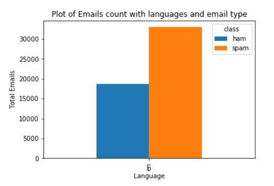
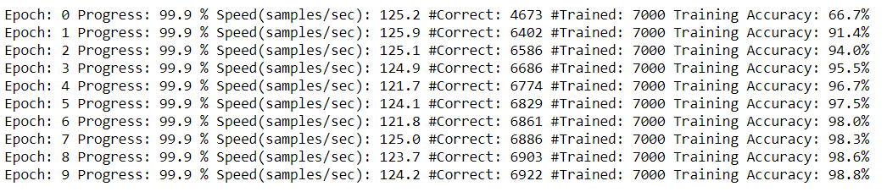

# Email Spam Classification

**AIM:**

Classifying Emails into Spam or Ham Emails using Neural Networks and Random Forest

This project uses the ENRON data sets. 
The data set is available at http://www2.aueb.gr/users/ion/data/enron-spam/

The email count used for the project is as shown below:

We have implemented Neural Networks project in two ways:
 1. Creating Neural Networks from scratch 
 2. Using Keras to model and test the Neural Network to classify emails into spam or ham
 
We have computed the Spam Misclassification Rate(SMR) and Ham Misclassification Rate(HMR). Additionally we have computed the heat map for the HMR and SMR.
The confusion matrix for the Random Forest and Keras Neural Network model is:

The training accuracy after fine tuning the NN model of python from scratch changed to 98% from 35%:

##### Future Work:
- Fine tune the NN from scratch and make it as efficient and fast as Keras model
- Work on the Email Subject for classifying them into Spam and Ham

